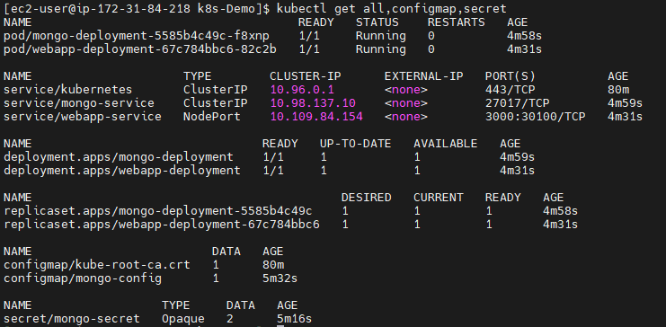
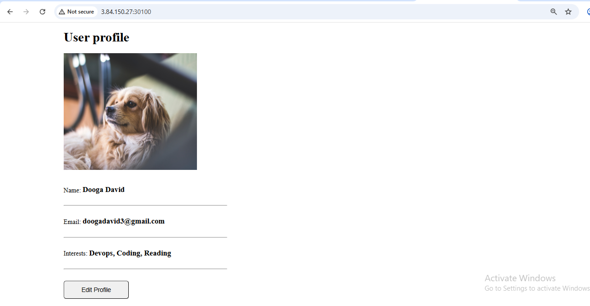

# 🚀 Kubernetes WebApp Deployment on AWS EC2
**A full-stack deployment using Minikube, MongoDB, and Nginx.**

---

## 🏗️ Architecture Overview
This project demonstrates a containerized web application deployed on a local Kubernetes cluster (Minikube) hosted on an AWS EC2 instance. 

- **Frontend/API:** Nginx-based Webapp
- **Database:** MongoDB
- **Infrastructure:** Minikube (Docker Driver)
- **Instance:** AWS EC2 (ec2-user)

---

## 🛠️ Deployment Manifests
The deployment is managed via four modular YAML files:
1. `configmap.yaml` - Environment variables and DB hosts.
2. `secrets.yaml` - Base64 encoded MongoDB credentials (template provided).
3. `db-deployment.yaml` - MongoDB Deployment and internal ClusterIP Service.
4. `webapp-deployment.yaml` - Webapp Deployment and NodePort Service.

---

## 🚀 Execution Steps

### 1. Environment Setup
The EC2 instance was prepared with Docker and Minikube.

minikube start --driver=docker

## Resources were applied in order of dependency:
```
kubectl apply -f k8s/mongo-config.yaml
kubectl apply -f k8s/secrets.yaml
kubectl apply -f k8s/mongo.yaml
kubectl apply -f k8s/webapp.yaml
```

Verify that all pods are running and services are mapped correctly:
```
kubectl get all
```


## 🌐 Public Access & Networking
While the application is exposed via a NodePort service within the Kubernetes cluster, Minikube runs on an isolated internal network. To bridge the traffic from the EC2 Public IP to the internal Minikube cluster, a port-forwarding tunnel is required.

## The Challenge: Internal vs. External Networking
Minikube's nodes are assigned internal IPs (typically 192.168.49.x) that the AWS Security Group cannot "see" directly. Even if you open the NodePort in the AWS Console, the traffic hits the EC2 instance but doesn't know how to reach the Minikube node.

## The Solution: Port Forwarding
To make the webapp accessible from a local laptop browser, I established a tunnel that maps all traffic from the EC2 instance's external interface to the Kubernetes service:

# Run this on the EC2 Instance
```
kubectl port-forward --address 0.0.0.0 svc/webapp-service <NodePort>:<Service-Port>
```
--address 0.0.0.0: This tells Kubernetes to listen on all available network interfaces, including the EC2 Public IP.
<NodePort>: The external port opened in the AWS Security Group.
<Service-Port>: The internal port defined in webapp.yaml (e.g., 80 or 3000).

Once the tunnel is active, the application is reachable at:
URL: http://<EC2-PUBLIC-IP>:<NodePort>


